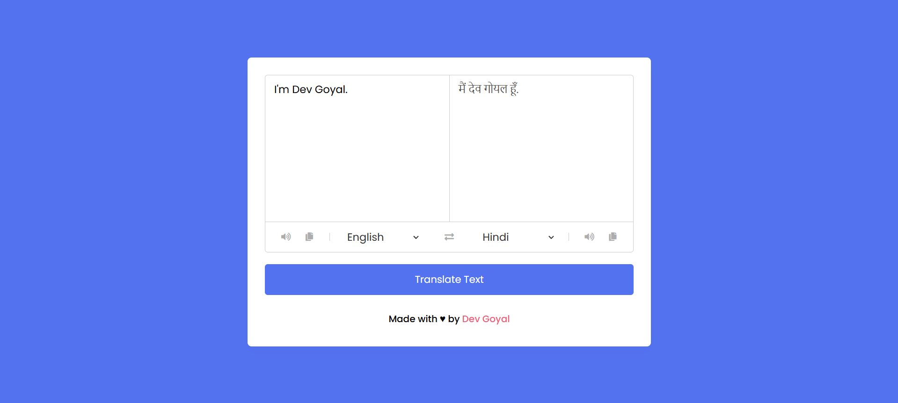

[](https://github.com/DevGoyalG)
[](https://github.com/DevGoyalG?tab=repositories)


<h1 align="center"> Language Translator App </h1>

<p align="center"> <b> If you found this repository helpful, give us a  ⭐️ </b> </p>
<p align="center"></a> </p>

A simple Language Translator app that allows users to translate text between different languages. The app integrates with a translation API to fetch translations in real time. In addition, it includes functionality to copy the translated text and speak the translated text aloud using the browser's text-to-speech feature.

## 🌐 Live Demo
Check out the live demo of the Language Translator App [here](https://languages-translators.netlify.app/).

## 📸 Project Preview
Here's a sneak peek of the Language Translator App:



## 🚀 Features
- Allows users to translate text between multiple languages.
- Provides a copy button to copy the translated text to the clipboard.
- Uses Text-to-Speech to speak the translated text aloud.
- Supports real-time translation with automatic language detection.
- Simple and responsive design for both desktop and mobile devices

## 🛠️ Tech Stack
- **HTML** : For the structure of the translation form and layout.
- **CSS** : For styling the page and making the user interface clean and user-friendly.
- **JavaScript** : For handling user input, interacting with the translation API, and implementing the text-to-speech and copy functionalities.

## 🧑‍💻 Getting Started

Follow the steps below to clone and use the project locally:

### 1. Prerequisites
Make sure you have **Git** installed. If not, you can download it [here](https://git-scm.com/).

### 2. Clone the Repository
```bash
git clone https://github.com/DevGoyalG/Language-Translator-App.git
```

### 3. Set up the API Key
- Sign up for a free account at Google Cloud Translate API or use an open-source option like LibreTranslate.
- After getting your API key, configure it in your JavaScript file (app.js) where the API key needs to be inserted.


## 🤝 Contributing
Contributions are welcome! If you have suggestions or want to report an issue, feel free to open an issue or create a pull request.

## 👨‍💻 Created by
This project was created and is maintained by:
**Dev Goyal**

Feel free to reach out if you have any questions or suggestions! ❤️
